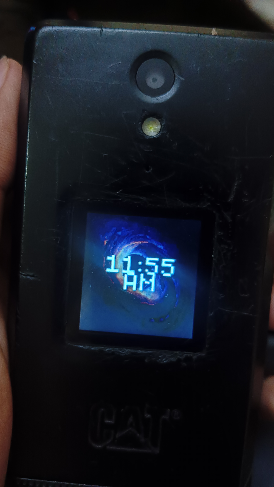
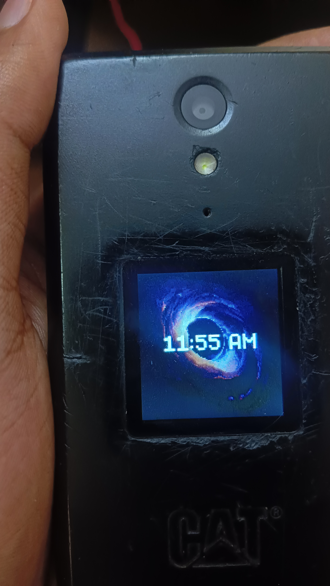
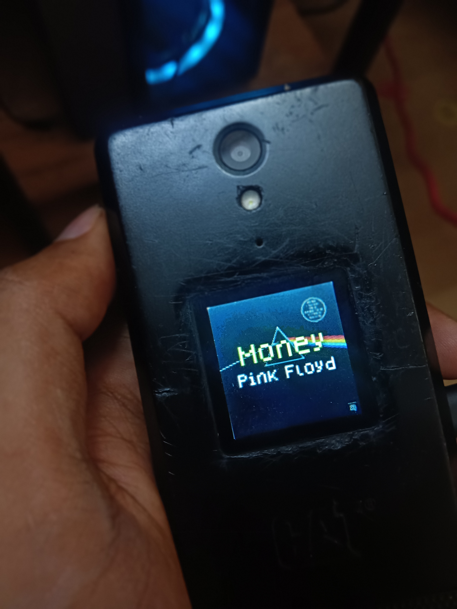

# Flip Face (Cat S22 External Screen Controller)

Welcome to **Flip Face**! This app completely transforms the tiny front screen of your Cat S22 Flip phone. Instead of a boring stock clock, you get a beautiful, highly customizable screen that doubles as an awesome retro music player.

## Features

### 🎵 Smart Music Player
*   **Walkman Mode:** Whenever you play music on Spotify, YouTube Music, or any other app, your front screen instantly turns into a sleek mini music player. 
*   **Dynamic Colors:** The app is smart! It looks at your song's album art and automatically changes the font colors to match perfectly, making the text pop against the background.

### Custom Wallpapers & GIFs Support
*   **Make It Yours:** You aren't stuck with boring backgrounds anymore. You can pick *any* image or animated GIF from your phone and set it as your front screen wallpaper!
*   **Clock & Notifications:** When music isn't playing, your custom GIF loops in the background with a stylish retro clock in the center. Your incoming notifications will pop up right underneath it.

### Cat S22 Buttons Support
*   **Easy Controls:** The settings menu has been completely redesigned. You don't need to struggle with the tiny touch screen—you can navigate all the settings smoothly using just your physical D-Pad buttons!
*   **Font Resizer:** A simple slider lets you make the clock and text as big or small as you want.

## Screenshots

  
  
  

## 🛠️ How to Install

1.  Download the newest APK from this repository or build it yourself.
2.  Install it on your Cat S22 Flip.
3.  **Important:** When you first open it, allow "Notification Access." The app needs this permission so it knows when your music starts playing!
4.  Open the settings, pick a cool GIF, and enjoy!

##  Known Bugs

*   **Always-On Display Battery Drain:** There is a known bug where the external screen stays awake (Always-On) even if you are just using a static image instead of a moving GIF. Flip the phone once more to stop it. 
*   **Missing Album Art:** Some rare or older music player apps don't share their album art correctly with Android. If this happens, Flip Face will just show a basic music screen without the custom colors.
